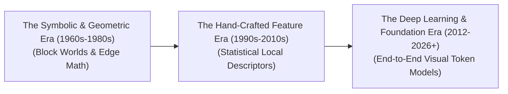

# Awesome-Computer-Vision
## Computer Vision (CV): History, Progression, Evolution, & Paradigms

Computer Vision (CV) is a foundational field of Artificial Intelligence dedicated to enabling digital systems to process, interpret, visually reconstruct, and reason about visual data, such as images, videos, and multi-dimensional spatial grids. Over more than six decades, the field has transitioned from basic binary line extraction to hand-crafted geometric models, statistical feature engineering, and modern web-scale multimodal foundation networks. What began as a brief summer academic project has evolved into a ubiquitous cognitive layer driving global industrial automation, medical diagnostics, autonomous transport, and human-computer synthesis.

---

## 1. The Macro Chronological Evolution

The overarching trajectory of Computer Vision reflects a systemic shift from hand-crafted mathematical rules and symbolic geometry to data-driven deep representations and unified multimodal sequence spaces.

*   **The Symbolic, Geometric, & "Block Worlds" Era (~1960s–1980s)**
    *   *Concept:* The genesis of the field. Early researchers conceptualized vision as a sequential process of edge extraction followed by geometric reasoning. Larry Roberts' 1963 PhD thesis ("Block World") [1] proved that 3D solid structures could be mathematically reconstructed from 2D line drawings. This era relied on hardcoded mathematical calculus—such as Sobel, Canny, and Marr’s vision paradigm [2]—to isolate lines, textures, and shading shapes manually.
    *   *Limitation:* Rigidly fragile. The systems collapsed instantly when introduced to natural lighting variations, occlusions, background noise, or non-geometric real-world objects.
*   **The Statistical & Hand-Crafted Feature Descriptor Era (~1990s–2011)**
    *   *Concept:* Shifted from global geometric models to invariant local descriptors. Instead of hardcoding complete object math, engineers designed highly robust local feature extractors that were statistically invariant to scale, illumination, and rotation. Algorithms like **SIFT (1999)**, **HOG (2005)**, and the **Viola-Jones object detection framework (2001)** [5] converted localized pixel matrices into mathematical signatures, routing them through classical machine learning classifiers like Support Vector Machines (SVMs).
    *   *Limitation:* Introduced a heavy human engineering bottleneck. Designing descriptors required years of manual math tuning, and features were incapable of learning higher-level semantic contexts natively.
*   **The Deep Learning, Transformer, & Foundation Era (2012–Present)**
    *   *Concept:* Sparked by the historic performance of **AlexNet (2012)** [6] on the ImageNet challenge. Hand-crafted features were discarded entirely in favour of end-to-end **Convolutional Neural Networks (CNNs)** [6, 7] that learned representations directly from data. This evolved into the **Vision Transformer (ViT, 2020)**, treating image patches exactly like sentence tokens. Today, the field has converged on **Multimodal Foundation Models (like CLIP, SigLIP, and GPT-4o)**, where vision and text share a unified, omnidirectional latent token space natively.

---

## 2. Core Methodological Paradigms

Depending on the underlying mathematical strategy used to transform pixel fields into actionable representations, the evolution of CV is characterized by distinct algorithmic schools.

- ### A. Classical Mathematical & Edge-Based Vision
    *   **Mechanism:** Applies spatial gradient operators across an image to detect discontinuities in brightness, utilizing Hough transforms to link edges into structural shapes.
    *   **Key Algorithms:** Canny Edge Detection, Sobel Filters, and Laplacian of Gaussian.

- ### B. Local Feature Matching & Keypoint Pipelines
    *   **Mechanism:** Scans images for highly salient localized anchor points (like corners or high-contrast blobs), creating a mathematical patch vector descriptor that can be searched and matched across different camera angles.
    *   **Key Algorithms:** SIFT (Scale-Invariant Feature Transform), SURF, ORB, and Harris Corner Detection.

- ### C. Connectionist Deep Spatial Encoding (CNNs)
    *   **Mechanism:** Implements localized convolutional kernels [7] that slide across a canvas, enforcing translation invariance and local connectivity. The network automatically stacks representations hierarchically (extracting raw lines in layer 1, textures in layer 4, and full object semantics in layer 16).
    *   **Key Architectures:** ResNet, VGG, MobileNet, and ConvNeXt.

- ### D. Attention-Driven Visual Patchification (ViTs)
    *   **Mechanism:** Discards convolutional assumptions completely. It flattens an image into non-overlapping grids of $14 \times 14$ or $16 \times 16$ pixel patches, projecting them linearly into a sequence of tokens processed via parallel multi-head self-attention mechanisms.
    *   **Key Architectures:** Vanilla ViT, Swin Transformer, and Multi-Head Latent Attention (MLA).

---

## 3. The Core Vision Task Hierarchy

As the field expanded, the operational objectives of computer vision scaled from global image sorting to dense spatial tracking and 3D geometric synthesis.

| Task Complexity | Technical Objective | Modern AI Architecture | Real-World Application |
| :--- | :--- | :--- | :--- |
| **Image Classification** | Assigns a single categorical label to a complete visual frame. | ResNet, ConvNeXt, ViT | Catalog tagging, broad sorting. |
| **Object Detection** | Identifies the semantic class and draws an explicit 2D coordinate bounding box around entities. | YOLO, Grounding DINO, Deformable DETR | Autonomous vehicle obstacle tracking, security feeds. |
| **Semantic / Instance Segmentation** | Maps classification probabilities to every individual pixel coordinate, tracing absolute contours. | U-Net, Mask R-CNN, Segment Anything (SAM) | Medical tumor outline mapping, satellite crop zoning. |
| **Visual Grounding / OVM** | Localizes and masks arbitrary objects using free-form natural language prompts at inference time. | OWL-ViT, Grounded-SAM, OWL-ViT v2 | Zero-shot warehouse automation, open-set screening. |
| **Spatio-Temporal VideoQA** | Tracks logical cause-and-effect transitions and motions across chronological multi-frame video tokens. | Spatio-Temporal Diffusion Transformers (Sora, LTX-Video) | Predictive security analytics, automated sports auditing. |

---

## 4. Production Engineering Challenges & Historical Mitigations

Translating computer vision code from clean academic datasets into volatile, real-world physical deployment architectures introduces severe system bottlenecks.

*   **The Quadratic Context and Patch Explosion Problem**
    *   *The Bottleneck:* When processing multi-megapixel graphics or high-resolution document scans, slicing data into fine-grained visual patches creates thousands of active tokens. Feeding these arrays into standard attention graphs triggers a quadratic ($O(N^2)$) memory footprint spike, saturating GPU VRAM instantly.
    *   *Mitigation:* Implementing **Dynamic Resolution Patching (AnyRes)**, which intelligently processes coarse thumbnails alongside zoomed-in local sub-patches concurrently, coupled with **Linear Attention or Latent Compression Kernels** to reduce token density.
*   **The "Picasso Problem" and Inductive Bias Drift**
    *   *The Bottleneck:* Early CNNs overfitted to pure textures, while standard Vision Transformers lack the native spatial assumptions (inductive biases) of convolutions, requiring billions of images to understand basic object orientations without warping features.
    *   *Mitigation:* Deploying **Hybrid Vision Architectures**, blending local convolutional stems (for crisp edge handling) with global self-attention blocks (for long-range context tracking), optimized via self-supervised masked autoencoding (MAE).

---

## 5. Modern Frontier Applications

*   **Autonomous Vehicle Perception & Bird's-Eye-View (BEV) Stacks**
    *   *Application:* Merges continuous high-frame-rate streaming cameras, LiDAR 3D point clouds, and Radar data simultaneously. Deep spatial transformers project these unaligned inputs into a unified 3D BEV vector space, executing lane segmentation and multi-object collision-avoidance logic in severe weather conditions.
*   **Multimodal GUI Document Auditing & Robotic Grounding**
    *   *Application:* Powers vision-language model (VLM) operational agents. The vision pipeline processes interface screenshots, high-res blueprints, or complex multi-axis charts, extracting layout metrics to execute tool-augmented office tasks or calculate precise robotic tool manipulation vectors.
*   **High-Fidelity Generative Flow Matching & Video Synthesis**
    *   *Application:* Drives advanced generative physical simulators. By reversing ordinary differential equation (ODE) straight-line trajectories over noise tensors, spatial diffusion models synthesize photorealistic, physically consistent video sequences from text prompts, accelerating engineering pre-visualization loops.

---

## References
1. Roberts, L. G. (1963). *Machine Perception of Three-Dimensional Solids* (Doctoral dissertation, Massachusetts Institute of Technology).
2. Marr, D. (1982). *Vision: A computational investigation into the human representation and processing of visual information*. W. H. Freeman and Company.
3. Lowe, D. G. (1999). Object recognition from local scale-invariant features. *Proceedings of the Seventh IEEE International Conference on Computer Vision*, 2, 1150-1157.
4. Dalal, N., & Triggs, B. (2005). Histograms of oriented gradients for human detection. *IEEE Computer Society Conference on Computer Vision and Pattern Recognition (CVPR)*, 1, 886-893.
5. Viola, P., & Jones, M. (2001). Rapid object detection using a boosted cascade of simple features. *Proceedings of the 2001 IEEE Computer Society Conference on Computer Vision and Pattern Recognition (CVPR)*, 1, I-I.
6. Krizhevsky, A., Sutskever, I., & Hinton, G. E. (2012). ImageNet classification with deep convolutional neural networks. *Advances in Neural Information Processing Systems*, 25, 1097-1105.
7. He, K., Zhang, X., Ren, S., & Sun, J. (2016). Deep residual learning for image recognition. *Proceedings of the IEEE Conference on Computer Vision and Pattern Recognition (CVPR)*, 770-778.
8. Dosovitskiy, A., et al. (2020). An image is worth 16x16 words: Transformers for image recognition at scale. *arXiv preprint arXiv:2010.11929*.
9. Radford, A., et al. (2021). Learning transferable visual models from natural language supervision. *International Conference on Machine Learning (ICML)*, 8748-8763.

---

To advance this documentation repository, context, or layout, consider exploring the following development pathways:
* Implement a **Python script using PyTorch and Hugging Face** demonstrating how to load a modern Vision-Language model to extract zero-shot classification maps from an image via CLIP.
