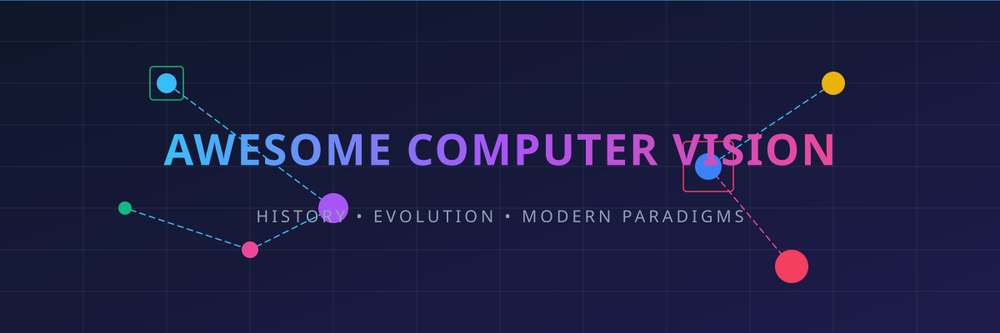
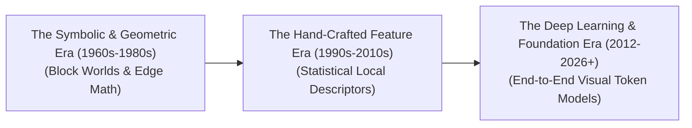

# Awesome-Computer-Vision 👁️🤖

<meta name="description" content="A curated list of awesome computer vision papers, evolution progression, architectures, tasks, and production engineering mitigations." />
<meta name="keywords" content="computer vision, deep learning, vision transformer, cnn, object detection, image classification, synthesis, BEV, RT-2, Flow Matching" />

  

     

## 🚀 Computer Vision (CV): History, Progression, Evolution, & Paradigms

Computer Vision (CV) is a foundational field of Artificial Intelligence dedicated to enabling digital systems to process, interpret, visually reconstruct, and reason about visual data, such as images, videos, and multi-dimensional spatial grids. Over more than six decades, the field has transitioned from basic binary line extraction to hand-crafted geometric models, statistical feature engineering, and modern web-scale multimodal foundation networks. What began as a brief summer academic project has evolved into a ubiquitous cognitive layer driving global industrial automation, medical diagnostics, autonomous transport, and human-computer synthesis.

---

## 📅 1. The Macro Chronological Evolution

The overarching trajectory of Computer Vision reflects a systemic shift from hand-crafted mathematical rules and symbolic geometry to data-driven deep representations and unified multimodal sequence spaces.

| Era | Core Concept | Limitations | First Used Year | First Paper Reference |
| :--- | :--- | :--- | :---: | :--- |
| [**The Symbolic, Geometric, & "Block Worlds" Era (~1960s–1980s)**](details/symbolic_geometric_era.md) | Vision as a sequential process of edge extraction followed by geometric reasoning. Larry Roberts' PhD thesis proved that 3D structures could be reconstructed from 2D drawings. Relied on hardcoded mathematical calculus (Sobel, Canny, Marr's paradigm). | Rigidly fragile. Collapsed when introduced to natural lighting variations, occlusions, background noise, or non-geometric real-world objects. | 1963 | [Roberts (1963)](https://dspace.mit.edu/handle/1721.1/11580) [[1]](#references) |
| [**The Statistical & Hand-Crafted Feature Descriptor Era (~1990s–2011)**](details/statistical_descriptor_era.md) | Invariant local descriptors. Hand-crafted feature extractors statistically invariant to scale, illumination, and rotation (SIFT, HOG, Viola-Jones), routed through Support Vector Machines (SVMs). | Heavy human engineering bottleneck. Required years of manual math tuning; incapable of learning higher-level semantic contexts natively. | 1999 | [Lowe (1999)](https://www.cs.ubc.ca/~lowe/papers/iccv99.pdf) [[3]](#references) |
| [**The Deep Learning, Transformer, & Foundation Era (2012–Present)**](details/deep_learning_foundation_era.md) | End-to-end Convolutional Neural Networks (CNNs) learning representations directly from data. Evolved into Vision Transformers (ViT) and Multimodal Foundation Models (CLIP, SigLIP, GPT-4o) sharing unified latent token spaces. | None (Represents the modern state-of-the-art paradigm) | 2012 | [Krizhevsky et al. (2012)](https://proceedings.neurips.cc/paper/2012/file/c3982bc38707c31290350448aa57c9a6-Paper.pdf) [[6]](#references) |

---

## ⚙️ 2. Core Methodological Paradigms

Depending on the underlying mathematical strategy used to transform pixel fields into actionable representations, the evolution of CV is characterized by distinct algorithmic schools.

| Paradigm | Mechanism | Key Algorithms / Architectures | First Used Year | First Paper Reference |
| :--- | :--- | :--- | :---: | :--- |
| [**A. Classical Mathematical & Edge-Based Vision**](details/classical_mathematical_vision.md) | Applies spatial gradient operators across an image to detect discontinuities in brightness, utilizing Hough transforms to link edges into structural shapes. | Canny Edge Detection, Sobel Filters, and Laplacian of Gaussian. | 1968 | [Sobel (1968)](https://research.gatech.edu/sites/default/files/2021-08/A%203x3%20Isotropic%20Gradient%20Operator%20for%20Image%20Processing.pdf) |
| [**B. Local Feature Matching & Keypoint Pipelines**](details/local_feature_matching.md) | Scans images for highly salient localized anchor points (like corners or high-contrast blobs), creating a mathematical patch vector descriptor that can be searched and matched across different camera angles. | SIFT, SURF, ORB, and Harris Corner Detection. | 1988 | [Harris & Stephens (1988)](https://www.bmva.org/conferences/avc/1988/050.pdf) |
| [**C. Connectionist Deep Spatial Encoding (CNNs)**](details/connectionist_deep_spatial_encoding.md) | Implements localized convolutional kernels [7] that slide across a canvas, enforcing translation invariance and local connectivity. Stacks representations hierarchically from raw lines to full object semantics. | ResNet, VGG, MobileNet, and ConvNeXt. | 1989 | [LeCun et al. (1989)](http://yann.lecun.com/exdb/publis/pdf/lecun-89e.pdf) |
| [**D. Attention-Driven Visual Patchification (ViTs)**](details/attention_driven_visual_patchification.md) | Discards convolutional assumptions. Flattens an image into non-overlapping grids of $14 \times 14$ or $16 \times 16$ pixel patches, projecting them linearly into a sequence of tokens processed via self-attention mechanisms. | Vanilla ViT, Swin Transformer, and Multi-Head Latent Attention (MLA). | 2020 | [Dosovitskiy et al. (2020)](https://arxiv.org/abs/2010.11929) [[8]](#references) |

---

## 📊 3. The Core Vision Task Hierarchy

As the field expanded, the operational objectives of computer vision scaled from global image sorting to dense spatial tracking and 3D geometric synthesis.

| Task Complexity | Technical Objective | Modern AI Architecture | Real-World Application |
| :--- | :--- | :--- | :--- |
| **Image Classification** | Assigns a single categorical label to a complete visual frame. | ResNet, ConvNeXt, ViT | Catalog tagging, broad sorting. |
| **Object Detection** | Identifies the semantic class and draws an explicit 2D coordinate bounding box around entities. | YOLO, Grounding DINO, Deformable DETR | Autonomous vehicle obstacle tracking, security feeds. |
| **Semantic / Instance Segmentation** | Maps classification probabilities to every individual pixel coordinate, tracing absolute contours. | U-Net, Mask R-CNN, Segment Anything (SAM) | Medical tumor outline mapping, satellite crop zoning. |
| **Visual Grounding / OVM** | Localizes and masks arbitrary objects using free-form natural language prompts at inference time. | OWL-ViT, Grounded-SAM, OWL-ViT v2 | Zero-shot warehouse automation, open-set screening. |
| **Spatio-Temporal VideoQA** | Tracks logical cause-and-effect transitions and motions across chronological multi-frame video tokens. | Spatio-Temporal Diffusion Transformers (Sora, LTX-Video) | Predictive security analytics, automated sports auditing. |

---

## 🛠️ 4. Production Engineering Challenges & Historical Mitigations

Translating computer vision code from clean academic datasets into volatile, real-world physical deployment architectures introduces severe system bottlenecks.

| Engineering Challenge | The Bottleneck | Mitigation | First Used Year | First Paper Reference |
| :--- | :--- | :--- | :---: | :--- |
| [**The Quadratic Context and Patch Explosion Problem**](details/quadratic_context_patch_explosion.md) | Slicing multi-megapixel graphics into fine-grained visual patches creates thousands of active tokens. Feeding them into standard attention graphs triggers a quadratic ($O(N^2)$) memory footprint spike, saturating GPU VRAM instantly. | Implementing **Dynamic Resolution Patching (AnyRes)** (processing coarse thumbnails and zoomed-in local sub-patches concurrently), coupled with **Linear Attention or Latent Compression Kernels**. | 2024 | [Liu et al. (LLaVA-NeXT) (2024)](https://arxiv.org/abs/2401.18059) |
| [**The "Picasso Problem" and Inductive Bias Drift**](details/picasso_problem_inductive_bias.md) | Early CNNs overfitted to pure textures. Standard Vision Transformers lack the native spatial assumptions (inductive biases) of convolutions, requiring billions of images to understand basic object orientations without warping features. | Deploying **Hybrid Vision Architectures** (blending local convolutional stems with global self-attention blocks), optimized via self-supervised masked autoencoding (MAE). | 2017 | [Sabour et al. (Capsule Networks) (2017)](https://arxiv.org/abs/1710.09829) |

---

## 🌟 5. Modern Frontier Applications

| Application Field | Technical Description & Workflow | First Used Year | First Paper Reference |
| :--- | :--- | :--- | :--- |
| [**Autonomous Vehicle Perception & Bird's-Eye-View (BEV) Stacks**](details/autonomous_vehicle_perception_bev.md) | Merges continuous high-frame-rate streaming cameras, LiDAR 3D point clouds, and Radar data simultaneously. Deep spatial transformers project inputs into a unified 3D BEV vector space, executing lane segmentation and multi-object collision-avoidance logic. | 2020 | [Philion & Fidler (LSS) (2020)](https://arxiv.org/abs/2008.05711) |
| [**Multimodal GUI Document Auditing & Robotic Grounding**](details/multimodal_gui_document_auditing.md) | Powers vision-language model (VLM) operational agents. Processes interface screenshots, high-res blueprints, or complex multi-axis charts, extracting layout metrics to execute tool-augmented office tasks or calculate robotic tool manipulation vectors. | 2023 | [Brohan et al. (RT-2) (2023)](https://arxiv.org/abs/2307.15818) |
| [**High-Fidelity Generative Flow Matching & Video Synthesis**](details/high_fidelity_generative_flow_matching.md) | Drives advanced generative physical simulators. By reversing ordinary differential equation (ODE) straight-line trajectories over noise tensors, spatial diffusion models synthesize photorealistic, physically consistent video sequences from text prompts. | 2022 | [Lipman et al. (Flow Matching) (2022)](https://arxiv.org/abs/2210.02099) |

---

## 📚 References
1. Roberts, L. G. (1963). *Machine Perception of Three-Dimensional Solids* (Doctoral dissertation, Massachusetts Institute of Technology).
2. Marr, D. (1982). *Vision: A computational investigation into the human representation and processing of visual information*. W. H. Freeman and Company.
3. Lowe, D. G. (1999). Object recognition from local scale-invariant features. *Proceedings of the Seventh IEEE International Conference on Computer Vision*, 2, 1150-1157.
4. Dalal, N., & Triggs, B. (2005). Histograms of oriented gradients for human detection. *IEEE Computer Society Conference on Computer Vision and Pattern Recognition (CVPR)*, 1, 886-893.
5. Viola, P., & Jones, M. (2001). Rapid object detection using a boosted cascade of simple features. *Proceedings of the 2001 IEEE Computer Society Conference on Computer Vision and Pattern Recognition (CVPR)*, 1, I-I.
6. Krizhevsky, A., Sutskever, I., & Hinton, G. E. (2012). ImageNet classification with deep convolutional neural networks. *Advances in Neural Information Processing Systems*, 25, 1097-1105.
7. He, K., Zhang, X., Ren, S., & Sun, J. (2016). Deep residual learning for image recognition. *Proceedings of the IEEE Conference on Computer Vision and Pattern Recognition (CVPR)*, 770-778.
8. Dosovitskiy, A., et al. (2020). An image is worth 16x16 words: Transformers for image recognition at scale. *arXiv preprint arXiv:2010.11929*.
9. Radford, A., et al. (2021). Learning transferable visual models from natural language supervision. *International Conference on Machine Learning (ICML)*, 8748-8763.

---

To advance this documentation repository, context, or layout, consider exploring the following development pathways:
* Implement a **Python script using PyTorch and Hugging Face** demonstrating how to load a modern Vision-Language model to extract zero-shot classification maps from an image via CLIP.
