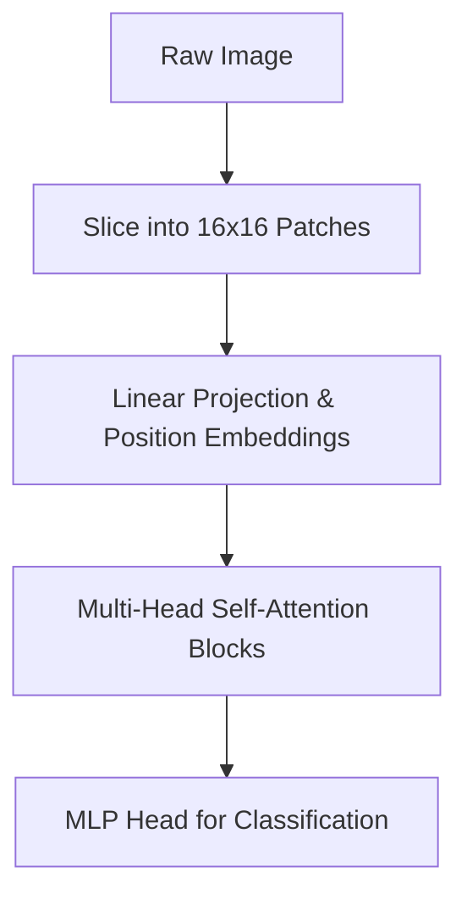

# Attention-Driven Visual Patchification (ViTs)

## Overview
Vision Transformers (ViTs) discard convolutional local assumptions entirely, framing computer vision as a sequence modeling task using visual tokens.

## Key Concepts
- **Patchification:** Dividing a 2D image into non-overlapping spatial grids.
- **Linear Projection:** Embedding patches into high-dimensional space as 1D sequence tokens.
- **Self-Attention:** Processing sequence tokens dynamically using long-range contextual associations.

## Diagram

## References
- Dosovitskiy, A., et al. (2020). *An image is worth 16x16 words: Transformers for image recognition at scale*.
