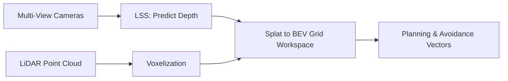

# Autonomous Vehicle Perception & Bird's-Eye-View (BEV) Stacks

## Overview
Bird's-Eye-View (BEV) perception fuses diverse unaligned sensory feeds (cameras, LiDAR, Radar) into a unified orthographic 3D grid workspace for path planning.

## Key Concepts
- **Lift-Splat-Shoot (LSS):** Predicting categorical depth distributions per pixel to lift 2D image coordinates into 3D camera coordinates.
- **Splatting:** Accumulating coordinates onto a reference BEV grid.
- **Multi-Sensor Fusion:** Unifying multi-view images and point clouds into a shared spatial representation.

## Diagram

## References
- Philion, J., & Fidler, S. (2020). *Lift, Splat, Shoot: Encoding Images from Arbitrary Camera Rigs by Implicitly Projecting to 3D*.
- Li, Z., et al. (2022). *BEVFormer: Learning Bird's-Eye-View Representation from Multi-Camera Images via Spatial-Temporal Transformers*.
