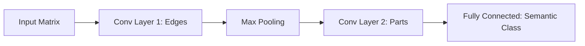

# Connectionist Deep Spatial Encoding (CNNs)

## Overview
Convolutional Neural Networks (CNNs) enforce spatial inductive biases, namely local connectivity and translation equivariance, to learn hierarchical representations.

## Key Concepts
- **Convolutions:** Sliding kernels that extract local spatial correlations.
- **Pooling:** Downsampling matrices to achieve translation invariance and reduce dimensionality.
- **Hierarchical Semantics:** Shallow layers capture edges and textures; deep layers capture complete object categories.

## Diagram

## References
- LeCun, Y., et al. (1989). *Backpropagation Applied to Handwritten Zip Code Recognition*.
- He, K., et al. (2016). *Deep residual learning for image recognition*.
