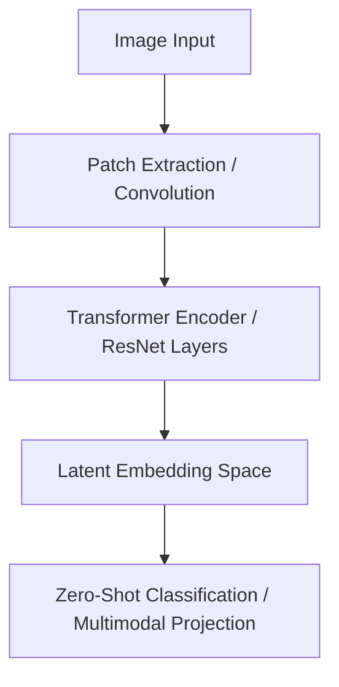

# The Deep Learning, Transformer, & Foundation Era (2012–Present)

## Overview
This era represents the transition from hand-crafted visual descriptors to representation learning, where features are learned directly from massive datasets.

## Key Concepts
- **Convolutional Neural Networks (CNNs):** Stacked layers representing local hierarchies.
- **Vision Transformers (ViT):** Image patch projection processed via multi-head self-attention.
- **Multimodal Foundation Models:** Shared latent space for text and image modalities (e.g., CLIP).

## Diagram

## References
- Krizhevsky, A., et al. (2012). *ImageNet classification with deep convolutional neural networks*.
- Dosovitskiy, A., et al. (2020). *An image is worth 16x16 words: Transformers for image recognition at scale*.
- Radford, A., et al. (2021). *Learning transferable visual models from natural language supervision*.
