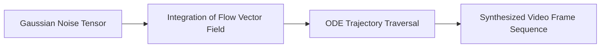

# High-Fidelity Generative Flow Matching & Video Synthesis

## Overview
Flow Matching is a generative modeling framework that trains continuous normalizing flows using regression targets, offering faster training and higher fidelity than traditional diffusion models.

## Key Concepts
- **Flow Matching:** Regressing vectors directly toward linear interpolations of target probability paths.
- **Continuous-Time Generative Simulation:** Integrating learned velocity fields to map noise vectors to complex distributions (images, videos).

## Diagram

## References
- Lipman, Y., et al. (2022). *Flow Matching for Generative Modeling*.
