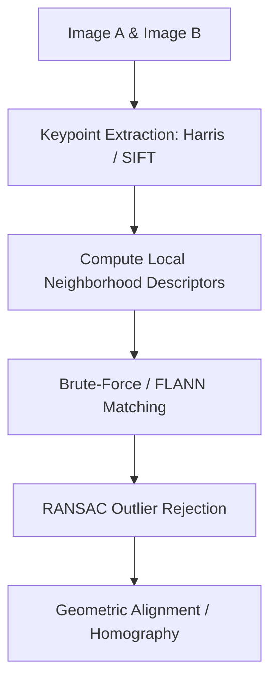

# Local Feature Matching & Keypoint Pipelines

## Overview
Local feature matching isolates distinctive interest points (keypoints) in an image to build rotation- and scale-invariant descriptors.

## Key Concepts
- **Corner Detection:** Mathematical analysis of eigenvalue variations (e.g., Harris Corner).
- **Blob Detection:** Laplacian/Difference of Gaussians.
- **Descriptors:** Summarizing local pixel neighborhood structures (e.g., SIFT, ORB).
- **Matching:** Nearest-neighbor searches pruned via RANSAC geometric consistency checks.

## Diagram

## References
- Harris, C., & Stephens, M. (1988). *A combined corner and edge detector*.
- Lowe, D. G. (1999). *Object recognition from local scale-invariant features*.
