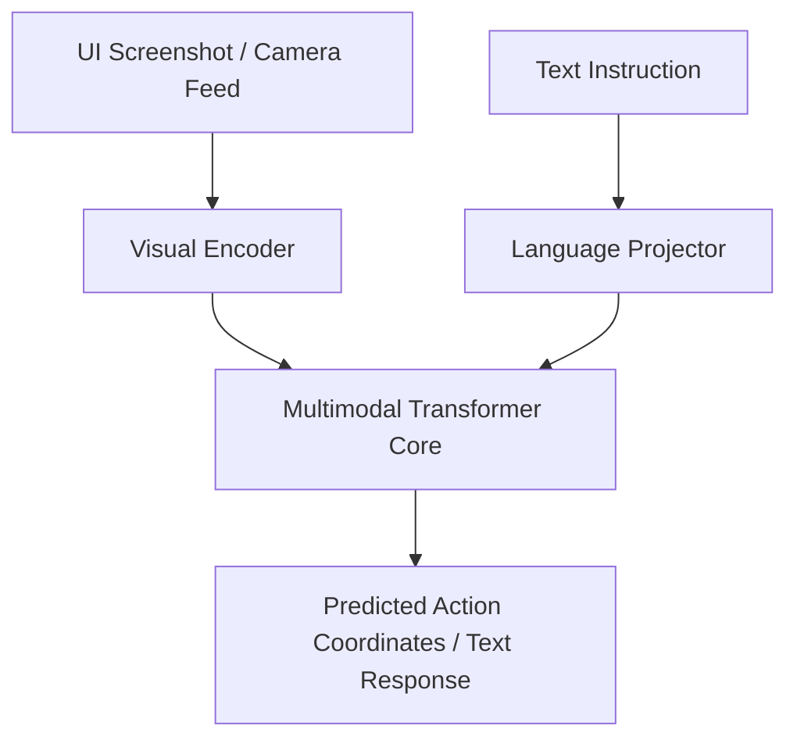

# Multimodal GUI Document Auditing & Robotic Grounding

## Overview
Vision-Language-Action (VLA) models combine visual inputs, text instructions, and coordinates to audit web/document interfaces or execute robotic tasks.

## Key Concepts
- **Robotic Grounding:** Predicting spatial movement vectors directly from raw visual patches.
- **GUI Agents:** Interpreting interface layouts (buttons, inputs) and returning corresponding click/scroll coordinates.

## Diagram

## References
- Brohan, A., et al. (2023). *RT-2: Vision-Language-Action Models Transfer Web Knowledge to Robotic Control*.
