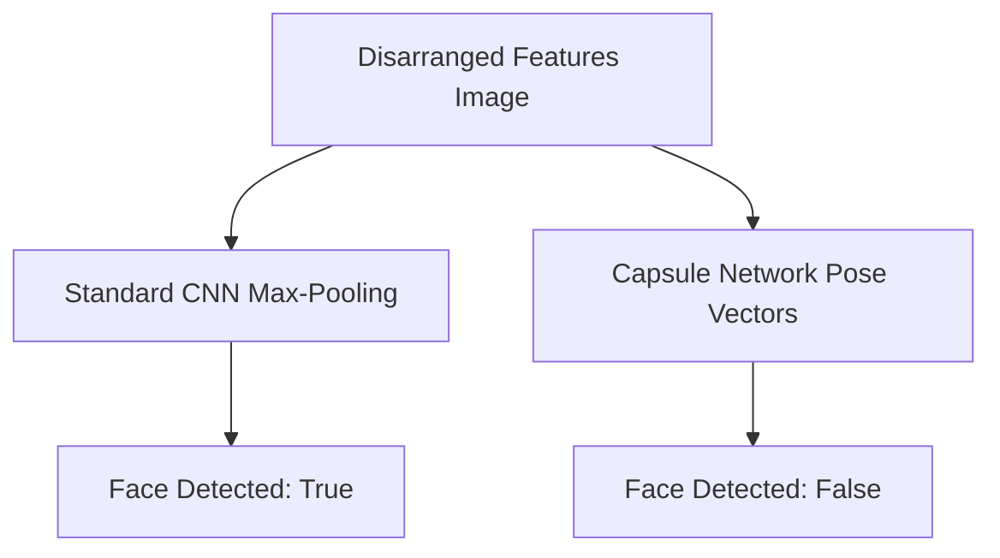

# The "Picasso Problem" and Inductive Bias Drift

## Overview
The "Picasso Problem" occurs when spatial hierarchical arrangements of components are ignored by vision networks, leading to semantic classification failures.

## Key Concepts
- **Picasso Defect:** A network identifying a jumbled face (eyes, nose, mouth in incorrect order) as a valid face due to spatial pooling distortions.
- **Inductive Biases:** Assumptions built into architecture layers (e.g. convolutions assume local continuity).
- **Capsule Networks:** Encoding physical poses and spatial arrangements explicitly using vector activities.

## Diagram

## References
- Sabour, S., Frosst, N., & Hinton, G. E. (2017). *Dynamic Routing Between Capsules*.
