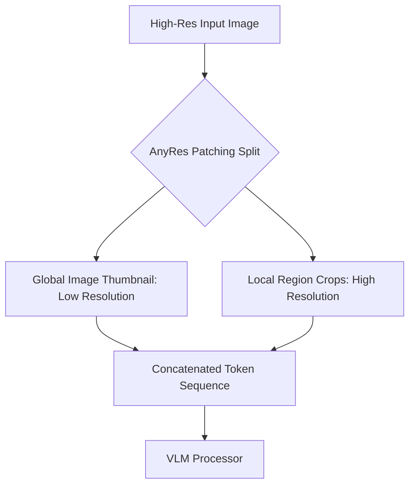

# The Quadratic Context and Patch Explosion Problem

## Overview
High-resolution images generate thousands of patches, leading to quadratic computational complexity in standard transformer self-attention engines.

## Key Concepts
- **Quadratic Complexity:** Self-attention scales as $O(N^2)$ where $N$ is the number of tokens/patches.
- **Dynamic Resolution (AnyRes):** Processing images globally at a low resolution while maintaining high-resolution detail only for selected sub-patches.
- **Linear/Compressed Attention:** Reducing token counts using pooling or kernel-based linear approximations.

## Diagram

## References
- Liu, H., et al. (2024). *Improved Baselines with Visual Instruction Tuning* (LLaVA-NeXT).
- Katharopoulos, A., et al. (2020). *Transformers are RNNs: Fast Autoregressive Transformers with Linear Attention*.
