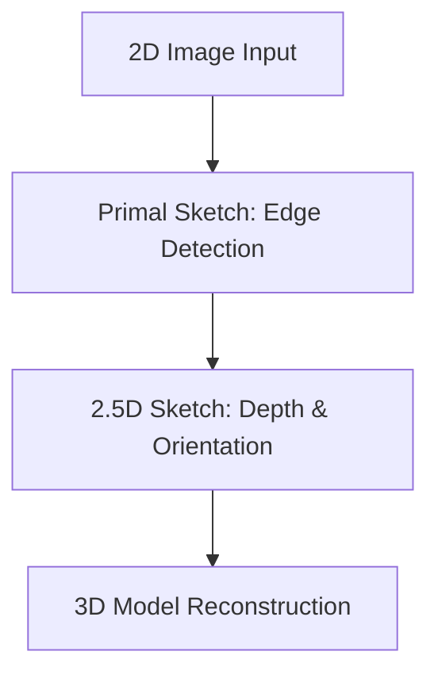

# The Symbolic, Geometric, & "Block Worlds" Era (~1960s–1980s)

## Overview
The Symbolic, Geometric, & "Block Worlds" Era represents the genesis of computer vision. Early researchers conceptualized vision as a sequential process of edge extraction followed by geometric reasoning.

## Key Concepts
- **Block World Reconstruction:** Proved that 3D solid structures could be mathematically reconstructed from 2D line drawings.
- **Edge Math:** Hand-crafted operators (Sobel, Canny, Marr) to extract boundaries.
- **Marr's Paradigm:** Vision as a hierarchical progression from a primal sketch (2D) to a 2.5D sketch (depth, orientation) and finally a 3D model.

## Diagram

## References
- Roberts, L. G. (1963). *Machine Perception of Three-Dimensional Solids*.
- Marr, D. (1982). *Vision*.
